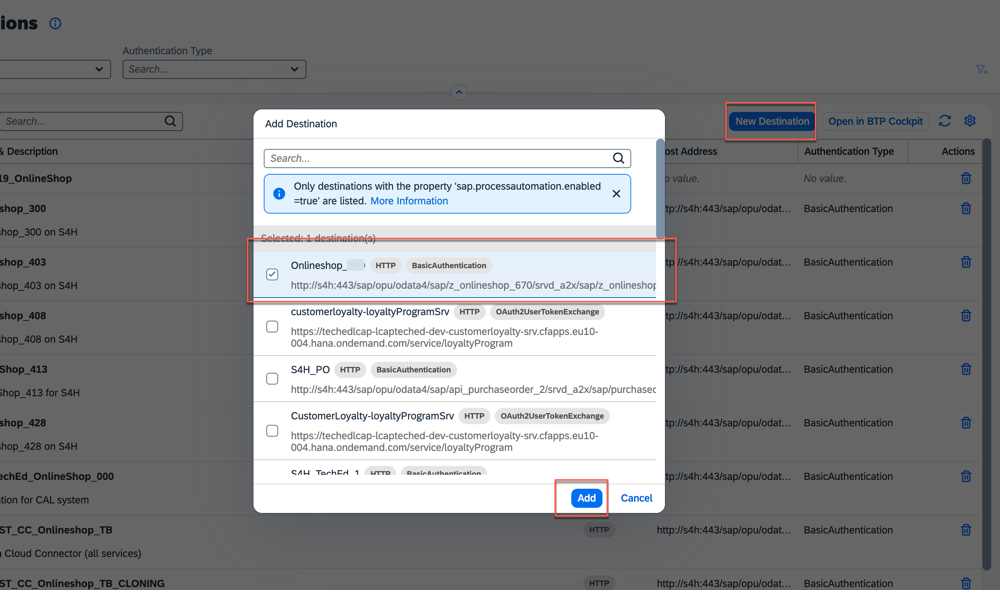

# Exercise 1: Create Actions in SAP Build to access the Onlineshop API

From this exercise on, we will switch to SAP's Business Technology Platform (BTP) on which SAP's solution for citizen developers, SAP Build run.

In this exercise we will create Actions in SAP Build that access the Onlineshop API on S/4HANA from the previous chapter. There will be 2 actions, one to read all the onlineshop entries and another one that creates a new onlineshop entry. 

To create such Actions we need to prepare 2 things first:
- create a destination in BTP to create the secure connectivity from a BTP subaccount to the Onlineshop API on S/4HANA from the previous chapters
- download the OData metadata document of the Onlineshop API from the previous chapter

## Exercise 1.1: Create a Destination in a BTP subaccount to access the Onlineshop API

We will now create the destination in a BTP subaccount to our Onlineshop API in the S/4HANA system from the previous chapter. The destination will ensure secure connectivity.

1. In your ABAP Development Tools under **Business Services** -> **Service Bindings** -> **Z_ONLINESHOP_###** copy the **Service URL**, it should be `/sap/opu/odata4/sap/z_onlineshop_###/srvd_a2x/sap/z_onlineshop_###/0001/` (Make sure you don't use the service binding for the UI but the Web API!)

2. In a browser open the [destinations view in the BTP Cockpit](https://emea.cockpit.btp.cloud.sap/cockpit/#/globalaccount/47ae62c5-c35b-48a4-99b1-eee46b5b62bf/subaccount/f65e327c-d9e9-44cd-8d7b-e4e7ea8db474/destinations)

3. Press the `New Destination` button.

4. Fill in the following:

    |  Porperty   | Value |
    |  :------------- | :------------- |
    |  Name   | Onlineshop_### |
    |  Type   | HTTP |
    |  Description   | Onlineshop_### on S4H |
    |  URL   | http://s4h:443 + the copied Onlineshop URL (e.g. /sap/opu/odata4/sap/z_onlineshop_###/srvd_a2x/sap/z_onlineshop_###/0001/) |
    |  Proxy Type   | OnPremise |
    |  Authentication   | BasicAuthentication |
    |  Location ID   | CALCC |
    |  User   | lowcode### |
    |  Password   | ######xx |

5. Then press the `New Property` button and add 
`sap.applicationdevelopment.actions.enabled` with value `true`

6. Press the `New Property` button again and add 
`sap.processautomation.enabled` with value `true`

7. Press `Save`

8. Press `Check Connection`: You should get a pop up that says `Connection to "Onlineshop_###" successful`

## Exercise 1.2: Download the OData metadata document of the Onlineshop API

In this exercise we will download the OData metadata document to a file to later use it for a definiton of an Action for SAP Build.

1. In your ABAP Development Tools you should still have the service binding ( under **Business Services** -> **Service Bindings** -> **Z_ONLINESHOP_###** ) open , this time, click on **Service URL**:

2. A browser window opens. The URL will look like this: 

        https://YY.YYY.YYY.YY:44301/sap/opu/odata4/sap/z_onlineshop_###/srvd_a2x/sap/z_onlineshop_###/0001/?sap-client=100

    Delete the `?sap-client=100` at the end and instead add `$metadata`, so the URL looks like this:

        https://YY.YYY.YYY.YY:44301/sap/opu/odata4/sap/z_onlineshop_###/srvd_a2x/sap/z_onlineshop_###/0001/$metadata

    Press `return` to load the metadata document

4. Right Mouse Click on the browser window and select `View Page Source` and press `Ctrl + A` + `Ctrl + C` (`Command + A` + `Command + C` on Mac) 

5. Open a text editor on your computer, paste the copied content using `Ctrl + V` (`Command + V` on Mac) and save the file as `Onlineshop_###_metadata.xml` to a location of your liking on your computer

## Exercise 1.3: Create Actions from the Onlineshop API

1. Open the [lobby](https://lcapteched.eu10.build.cloud.sap/lobby) in the browser with

        User: lowcodeuser+0###@gmail.com
    
        PW: XXXXXXX

    that is provided by the instructors by the workshop (note this is not the same user as for the ABAP development tools, it is a BTP user)

2. Press `Create`

3. Select `Build an Automated Process`

4. Select `Actions`

5. As Project Name choose `Onlineshop###Action`. Use the `Browse` button to locate the metadata file that you have saved in the previous step on your computer. Press `Create` 

6. Expand the entry `onlineshop` and select both, the `POST /onlineshop Add new entry to onlineshop` and the `Get /onlineshop Get entities from onlineshop`. Press `Add`

7. The 2 actions are now visible, select the `POST` one. In the right upper corner press the `Settings` button that looks like a gear wheel.

## Exercise 1.4: Test Actions from the Onlineshop API

1. Switch `Enable CSRF` to `yes` and press `Save`

2. To test the action, select the destination that you have created before `Onlineshop_###`. In the input fields below, write `AS02` for the `product` and a number into the `quantity` field. Press `Test`.

3. The result should look like this:

## Exercise 1.5: Release the Action and Publish to Library

In order to use the action inside SAP Build products like Process Automation, it has to be released first. Releasing means that the current state of the action is stored in an imutable way. Once the project is released, it can be published to library, which means that it is available inside SAP Build products like Process Automation, it can be discovered and used there.

1. In the upper right corner of your action press `Release`

2. Optionally add some release notes and press `Release` on the dialog

3. After you released the action, in the same upper right corner the button has changed to `release to library`, press it 

4. Confirm that you want to publish, pressing the button

## Excercise 1.6: Add the Destination to the SAP Build Settings

You have set up a destination in the BTP Cockpit to test our new actions and in the last step made the actions available for usage in SAP Build Process Automation. You now also need to register the destination with SAP Build to be used in a real environment of a process, not just for tests of actions.

1. In the SAP Build choose `Settings` and then `Destinations` in the left pane.

2. Press `New Destination` and search for your destination `Onlineshop_###` where of course `###` is your group ID. Select the destination and press `Add`.

## Summary  
 
You have created 2 actions based on the Onlineshop Service, you built on ABAP Cloud in the previous exercises. You have created a BTP destination to connect to the Online Service and you have tested the actions. You have released the action and published it to a library, so you can use it in the following chapter in a new SAP Build Process Automation. You have also registered the destination for usage in SAP Build. 
 
You can continue with the next exercise - **[Exercise 2: Create a Process in SAP Build Process Automation based on the Onlineshop Service](../ex2/README.md)**
