[Home ](../../README.md)  

# Exercise 1: Create an ABAP Package

## Introduction

In this exercise, you will create your exercise package and add an appropriate *ABAP repository tree* to the *Project Explorer* in your ADT.

<!--
We will continue to create a simple class to investigate 

- How ABAP cloud restricts the use of not released APIs
- How ABAP cloud restricts the use of outdated ABAP statements that are not part of the ABAP language version *ABAP for Cloud Development*   

We will then use this class to build a test class to call the released API **I_PurchaseRequisitionTP** before starting to build our own RAP BO that shall serve as an UI for an OnlineShop Application.  
 
Execrises 1.1 - 1.3 are essential for the exercise, the following exercises 1.4 - 1.7 are for your further information, you can skip them if you have limited time.
-->
> **Reminder:**   
> Don't forget to replace all occurences of the placeholder **`###`** with your group ID in the exercise steps below.  
> You can use the ADT function **Replace All** (**Ctrl+F**) for the purpose.   
> If you don't have a group ID yet, please check with your instructor.    

## Exercise 1.1: Create Package with language version ABAP for Cloud Development

> Create your exercise package .   
> This ABAP package will contain all the artefacts you will be creating in the different exercises of this hands-on session.

<!--
> **Note:**  
> In SAP led hands-on workshops it might be that a package `Z_ONLINESHOP_###` has already been created for you.  
> In this case you can continue with [Excercise 1.3](#exercise-13-create-a-class-to-test-abap-cloud-governance).  
-->    
 

  <!--

   1. In ADT, go to the **Project Explorer**, right-click on the folder **`Favorite Packages`**, and select **Add Package** from the context menu. 

   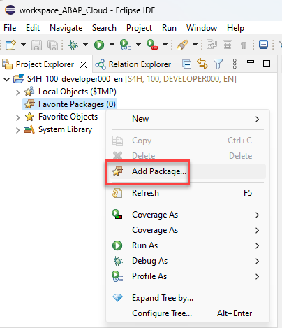.

   2. In the search dialogue start to type **ZLOCAL** and select the entry **ZLOCAL** from the result list.

   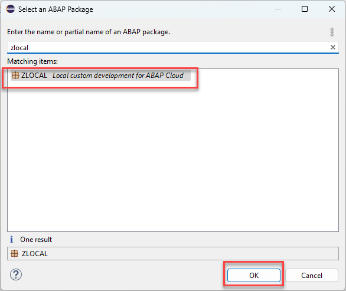.

  -->
   
   1. In ADT, again the **Project Explorer** right-click on the package **`ZLOCAL`**, and select **New** > **ABAP Package** from the context menu. 

   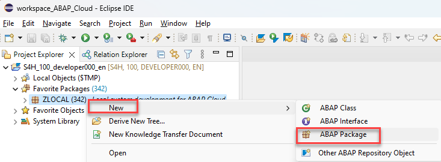

   
   2. Maintain the required information (`###` is your group ID):
       - Name: **`Z_ONLINESHOP_###`**
       - Description: _**`Online Shop ###`**_
       - Select the box **Add to favorites package**
       
      Click **Next >**.

   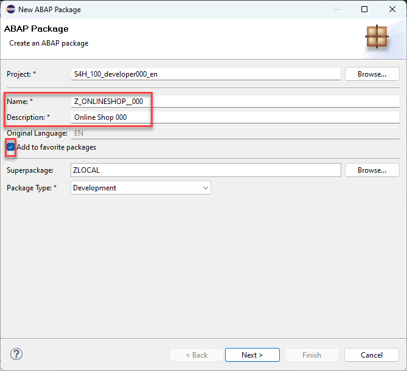.

   3. Do not enter an Application Component and press **Next**

   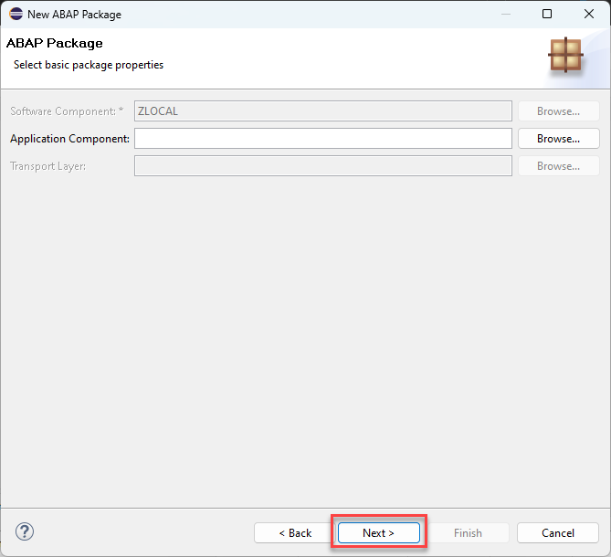.

   4. Create a new transport request, maintain a description (e.g. _**Online Shop Package ###**_), and click **Finish**.
      
   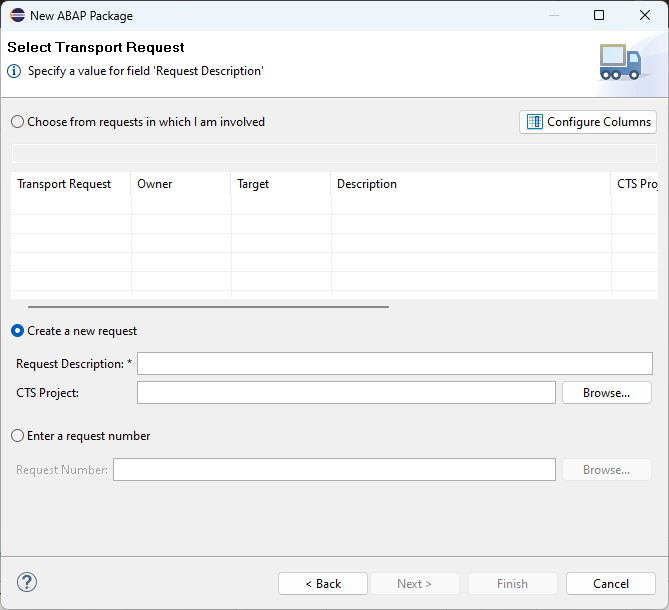.

   5. You should now see your new package in your **Project Explorer**.

   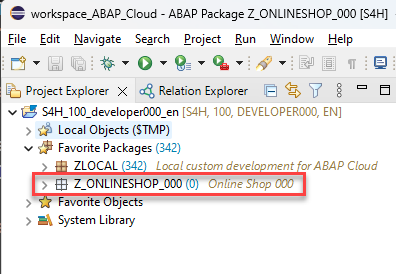

   6. Check the language version of your package

      As you can see your package has the superpackage `ZLOCAL`. This is a structure package that is part of the software component `ZLOCAL` which is configured for the use of **ABAP for Cloud Development** and the **Local Objects**. 

      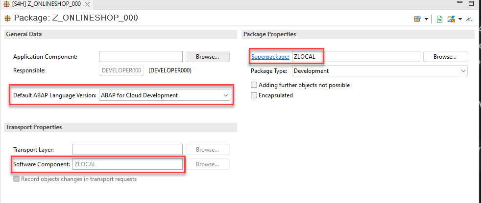.

<!--
## Exercise 1.2: Create a new ABAP class

> Create a class which will contain the logic.   

 

  
Click to expand!

   1. Right-click on your ABAP package **`z_online_shop_###`** and select **New** > **ABAP Class** from the context menu.

      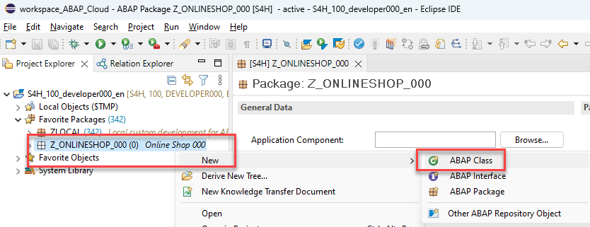. 
  
   3. Maintain the required information (`###` is your group ID).
      - Name: **`zcl_test_i_purchase_req_###`**
      - Description: _**`Test Purchase Req API I_PurchaserequisitionTP`**_                  

      Click on **Add** and select the interface `if_oo_adt_classrun`. 

      and click **Next >**

      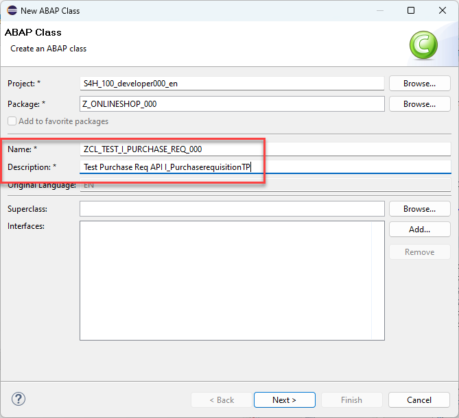. 

   4. Select a transport request, and click **Finish** to create the class.

-->

<!--
## Exercise 1.3: Implement Logic to call I_PurchaseRequisitionTP

We will implement a method that calls the API **I_PurchaseRequisitionTP** and that implements the interface **if_oo_adt_classrun** so we can start with basic tests by simply starting the `if_oo_adt_classrun~main( )` method of our test class by pressing **F9**.

The coding leverages the `response` parameter of EML statements that is used to specify response parameters for ABAP EML statements to get information on the following: 

- Failures, i. e. operations that could not get processed (FAILED failed_resp)   
- Key mapping information (MAPPED mapped_resp)   
- Returned error messages (REPORTED reported_resp)

By using the convert key command we are able to retrieve the semantic key that has been set by the purchase requisition API in the late numbering phase.   

<pre language=ABAP>
    COMMIT ENTITIES
      BEGIN RESPONSE OF i_purchaserequisitiontp
        FAILED DATA(failed_late)
        REPORTED DATA(reported_late).

        LOOP AT mapped-purchaserequisition ASSIGNING FIELD-SYMBOL(&lt;mapped&gt;).
          CONVERT KEY OF i_purchaserequisitiontp FROM &lt;mapped&gt;-%pid TO DATA(ls_ctr).
          &lt;mapped&gt;-PurchaseRequisition = ls_ctr-PurchaseRequisition.
        ENDLOOP.

        IF sy-subrc = 0.
          out->write( | PurchaseRequisition:  { ls_ctr-PurchaseRequisition } | ).
        ELSE.
          out->write( | Error PurchaseRequisition sy-subrc:  { sy-subrc } | ).
        ENDIF.
    COMMIT ENTITIES END.     
</pre>

See also the Development guide for the ABAP RESTful Application Programming Model, section [General RAP BO Implementation Contract](https://help.sap.com/docs/ABAP_PLATFORM_NEW/fc4c71aa50014fd1b43721701471913d/1040b81372d44ed38b07a409fa0e1769.html?locale=en-US&version=202210.000)  

 

  
Click to expand!

  1. Open the test class **zcl_test_i_purchase_req_###** that you have created before by locating it in the Project Explorer in your package or by pressing **Ctrl+Shift+A**  (**Command+Shift+A** on Mac).    

     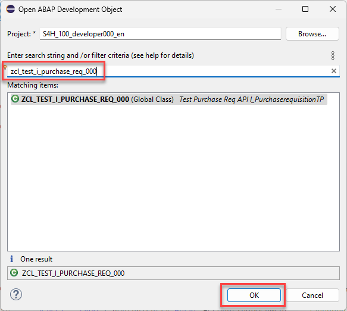  

  2. Replace the code in the `if_oo_adt_classrun~main( )` method with the following code snippet.   

     [source code main method](sources/main_test_class.txt)  

  3. Activate the code like this:.  

     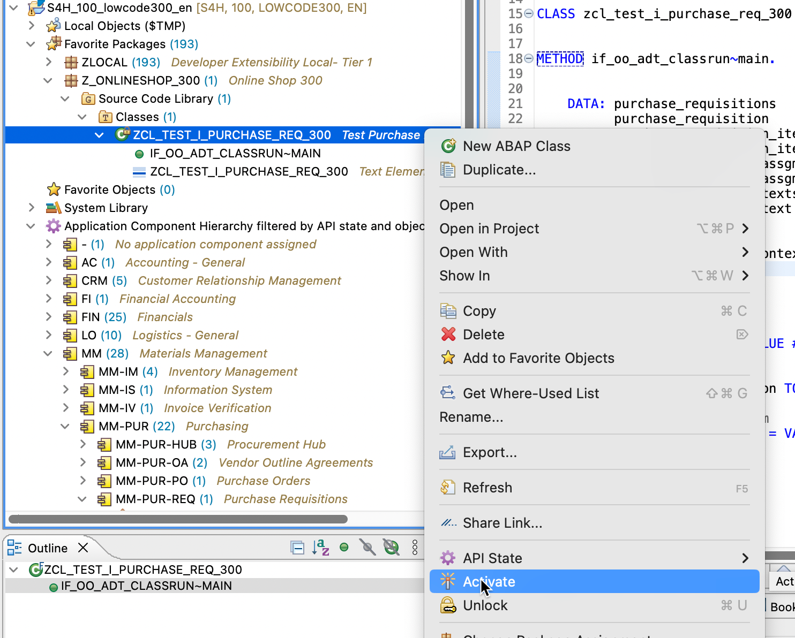  

  4. Run the test class by pressing **F9**.  

     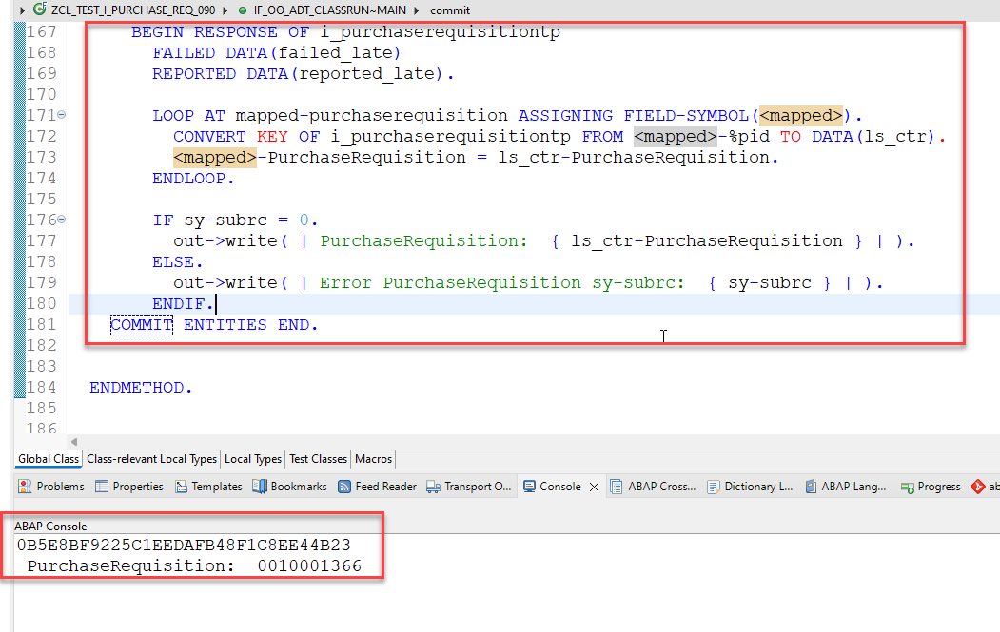  
     
     

 
 

You have now 
- created an ABAP package that has ABAP language version *ABAP for Cloud Development*,
- created a new ABAP class on  *ABAP Cloud*,
- Implemented a simple test class for the released API **I_PurchaseRequisitionTP** ,

You can now go to the remaining parts of exercise 1, exercises 1.4 to 1.7. These will explain to you 
- how you find released RAP Busindess Objects (1.4),
- how in ABAP Cloud there are restrictions with respect to applying statements and functions call from classical ABAP (1.5)
- how you can identify local APIs for S/4HANA Cloud via SAP Note 3088062 or GitHub (1.6)
- how you can check the documentation for RAP BO I_PurchaseRequisitionTP, which is used in this tutorial (1.7)
All of these are **optional** and you can therefore also skip them and continue with the next exercise - **[Exercise 2: Implement the business logic of your RAP BO](../ex2/#readme)**.

 

  
Click to expand execrise 1.4 - 1.7

-->

You have now created an ABAP package that has ABAP language version *ABAP for Cloud Development*.

Continue with the next exercise - **[Exercise 2: Create the OnlineShop Application](../ex2/#readme)**
