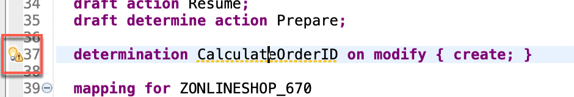

[Home ](../../README.md)  

# Exercise 3: Adapt the data model

## Introduction

In this exercise, you will adapt the data model of the newly generated RAP business object `ZR_ONLINESHOP_###`

<!--
## Exercise 3.0: Enhance the data model

In this step we will use a value help `ZI_PRODUCT_VH_REUSE` that has been provided for your in this workshop in the demo system. In addition some fields that are accessible via this association (e.g. the product description) will be included in the data model.  

When working with a system provided as part of a SAP workshop this view will be provided. If you try out this script in your own SAP S/4HANA 2022 on prem system you would have to create this view manually.  

The source code of ZI_PRODUCT_VH_REUSE can be found here:   
 [ZI_PRODUCT_VH_REUSE](sources/ZI_PRODUCT_VH_REUSE.txt) 

1. Open the cds view `ZR_ONLINESHOP_###` 

  

2. Add an association to the released CDS view for product data to it.
<pre lang="ABAP">
association [1..1] to ZI_PRODUCT_VH_REUSE as _Product on $projection.OrderItemID = _Product.Product
</pre>

3. Add the fields `_Product.ProductGroup`, `_Product.ProductText`, `_Product.BaseUnit` and the association `_Product` to the field list.

<pre lang="ABAP">
      ,
      _Product.ProductGroup,
      _Product.ProductText,
      _Product.BaseUnit,
      _Product
</pre>

  

4. Save and activate your changes

5. Open the cds view `ZC_ONLINESHOP_###` 
   
6. Add a value help for the field `OrderItemID`.
<pre lang="ABAP">
      @Consumption.valueHelpDefinition: [{ entity: { name: 'ZI_PRODUCT_VH_REUSE', element: 'Product' },
                                     useForValidation: true }  ]
</pre>

7. Add the fields `ProductGroup`, `ProductText`, `BaseUnit`, `CreatedAt` and the association `_Product` to the field list.
<pre lang="ABAP">
       ,
      CreatedAt,
      ProductGroup,
      ProductText,
      BaseUnit,
      _Product
</pre>

 

8. Save and activate your changes

-->
<!--
> **Note:**   
> When a starter project has been generated the field `CreatedAt` has already been added to the projection view.  
> You will thus get the following error message: *The name CreatedAt is not unique*   
> In this case simply delete or comment out the duplicate `CreatedAt` entry.
>    
>  
-->
 
## Exercise 3.1: Provide Metadata Extension for Fiori elements UI
 
1. Replace the complete source code of the Metadata Extension File **ZC_ONLINESHOP_###**.   

 

  Replace the placeholder `###` with your group ID and save and activate your changes.    

 
<pre lang="ABAP">
@Metadata.layer: #CORE
@UI: {
  headerInfo: {
    typeName: 'onlineshop',
    typeNamePlural: 'onlineshops'
  }
}
annotate view ZC_ONLINESHOP_XXX with
{
  @UI.facet: [ {
    id: 'idIdentification',
    type: #IDENTIFICATION_REFERENCE,
    label: 'onlineshop',
    position: 10
  } ]
  @UI.hidden: true
  orderuuid;

  @UI.lineItem: [ {
    position: 30 ,
    label: 'Order ID' ,
    importance: #MEDIUM
  } ]
  @UI.identification: [ {
    label: 'Order ID',
    position: 30
  } ]
  orderid;

  @UI.lineItem: [ {
    position: 10 ,
    label: 'Product' ,
    importance: #MEDIUM
  } ]
  @UI.identification: [ {
    position: 10,
    label: 'Product'
  } ]
  product;

  @UI.lineItem: [ {
    position: 20 ,
    label: 'Quantity' ,
    importance: #MEDIUM
  } ]
  @UI.identification: [ {
    position: 20 ,
    label: 'Quantity'
  } ]
  quantity;
  
  @UI.lineItem: [ {
    position: 40 , 
    label: 'Overall Status',
    importance: #MEDIUM
  } ]
  @UI.identification: [ {
    label: 'Overall Status',
    position: 40 
  } ]
  overallstatus;
  
  @UI.hidden: true
  locallastchangedat;
}
</pre>

  This metadata extension file includes the annotations that tell the Fiori elements UI which columns should go into the result list and which fields group a form on the object page. While most of the code was already generated automatically, we now add a couple of labels to the column headers and for the form and change the order of fields a bit to make the form nicer (order is changed via the 'importance' annotation).

2. Save  and activate  the changes.

## Exercise 3.2: Adapt the behavior definition

<!--
Since we have changed the field list of the projection view `ZC_ONLINESHOP_###` we have to regenerate the draft table.
-->

In the behavior definition we will also set several fields as read-only.

For fields that are read-only and that are not read from the value help we have to create determinations. 
  
  1. Open the behavior definition `ZR_ONLINESHOP_###`.  

    

  2. Add the following list of fields to mark them as read-only  
  <pre lang="ABAP">
   OrderID,
   OverallStatus,
  </pre>

  behind

  <pre lang="ABAP">
{
  field ( readonly )
   OrderUUID,
  </pre>

  in order to make the Order ID a read-only field.

    
 
  3. Save  and activate  the changes.

  4. In the **Project Explorer** under `Business Services`->`Service Bindings`->`ZUI_ONLINESHOP_O4_###` check the UI using the Fiori Elements preview. 

  On the list, press **Create** and you should see a form like this, where **Order ID** and **Overall Status** are text not input fields:

    
 
<!--
## Exercise 3.4: Define constants for lhc_onlineshop

As a preparation for implementing determinations and validations we will add constants in the local handler class `lhc_onlineshop` of the the behavior implementation class `ZBP_R_ONLINESHOP_###` so that these variables can be used by all implementations.  

   

  
Click to expand!

  
  1. Navigate to the behavior implementation class `ZBP_R_ONLINESHOP_###` in the *Project Explorer* and then click on the tab *Local Types*.   

    
  
  2. Start the implementation by adding the following constants in the private section of your local handler class `lhc_onlineshop`.   

  <pre lang="ABAP">
  
CLASS lcl_OnlineShop DEFINITION INHERITING FROM cl_abap_behavior_handler.
  PRIVATE SECTION.

    CONSTANTS:
      BEGIN OF is_draft,
        false TYPE abp_behv_flag VALUE '00', " active (not draft)
        true  TYPE abp_behv_flag VALUE '01', " draft
      END OF is_draft.
    CONSTANTS:
      BEGIN OF c_overall_status,
        new            TYPE string VALUE 'New / Composing',
        new_code       TYPE int1   VALUE 2, "'New / Composing'
        submitted      TYPE string VALUE 'Submitted / Approved',
        submitted_code TYPE int1   VALUE 3, "'Submitted / Approved'
      END OF c_overall_status.
      
   </pre>

   3. Save and activate your changes.

 

-->

## Exercise 3.3: Define determinations

  We now will create a determination which is called when a new online store entry is created. The determination will calculate a new Order ID. While the OrderUUID is generated automatically by the system upon save, the Order ID we have to generate ourselves. The corresponding code looks up the currently highest number for orders and then adds 1 for a new ID.
 
  1. Add the following determination to your behavior definition **ZR_ONLINESHOP_###** (in the **Project Explorer** under **Core Data Services** -> **Behavior Definitions**)

  <pre lang="ABAP">
  determination CalculateOrderID on modify { create; }
  </pre>

    

  2. Save  and activate  the changes.

  3. Use the quick fix by either clicking on    or with the cursor in the `determination` line by **Ctrl+1** (**Command+1** on Mac) to generate the appropriate methods in the behavior definition class.

   

  4. Then a new tab is openend with the generated handler that looks like this:

    

  5. Add the code snippet to implement the method `CalculateOrderID` for the determination `createOrderID`:
  
  Replace 
  <pre lang="ABAP">
      METHOD CalculateOrderID.
      ENDMETHOD.
  </pre>
  
  with:

   <pre lang="ABAP">
  
 METHOD CalculateOrderID.

    "read transfered instances
    READ ENTITIES OF ZR_OnlineShop_### IN LOCAL MODE
      ENTITY OnlineShop
        ALL FIELDS
        WITH CORRESPONDING #( keys )
      RESULT DATA(OnlineOrders).

    "ignore  entries with assigned order ID
    DELETE OnlineOrders WHERE OrderID IS NOT INITIAL.
    IF OnlineOrders IS NOT INITIAL.
      "get max order ID from the relevant active and draft table entries
      SELECT FROM ZOnlineShop_### FIELDS MAX( order_id ) INTO @DATA(max_order_id). "active table
      SELECT FROM ZdOnlineShop_### FIELDS MAX( orderid ) INTO @DATA(max_order_id_draft). "draft table

      IF max_order_id_draft > max_order_id.
        max_order_id = max_order_id_draft.
      ENDIF.

      DATA(OverallStatus) = |{ sy-uname } - is placing order request|.
      MODIFY ENTITIES OF ZR_OnlineShop_### IN LOCAL MODE
        ENTITY OnlineShop
          UPDATE FIELDS ( OrderID OverallStatus )
          WITH VALUE #( FOR order IN OnlineOrders INDEX INTO i (
                           %tky          = order-%tky
                           OrderID       = max_order_id + i
                           OverallStatus = overallstatus
                      ) )
        FAILED DATA(failed).

    ENDIF.

  ENDMETHOD.
 
  </pre>

  6. Replace the placeholders `###` with your group ID.

  The code reads all entries including the one that was just created. It looks at all the orders whether they already have an `OrderID`, it finds the order with the highest `OrderID`, assuming this is the newest. It adds 1 to the highest `OrderID` and assigns this new number to our new onlineshop record and modifies the database using EML ([Entity Manipulation Language](https://help.sap.com/docs/btp/sap-abap-restful-application-programming-model/entity-manipulation-language-eml))
 
 7. Save  and activate  the changes. 

## Exercise 3.4: Check your preview application

 1. Open the service binding `ZUI_ONLINESHOP_O4_###` (**Business Services** -> **Service Bindings**) to test your implementation by using the ADT Fiori preview. Alternatively, if you keep the browser window open with the Fiori preview, you can just refresh the browser and it will automatically reflect the new code.

 2. On the list, press `Create` and then on the object page enter a new onlineshop entry using for example a product `AS01` and a quantity `1` and then press the `Create` button in lower right corner.
  
  
  
  
  You should see somthing like this in the result, including the `Order ID`:

  

 ## Summary  
 
 You have implemented an adjustment to the Fiori elements UI and a determination to calculate a new order ID and to create a purchase requisiton in S/4HANA.   

 You can continue with the next exercise - **[Exercise 4: Create a Web API for the Onlineshop](../ex4/README.md)**.
 

