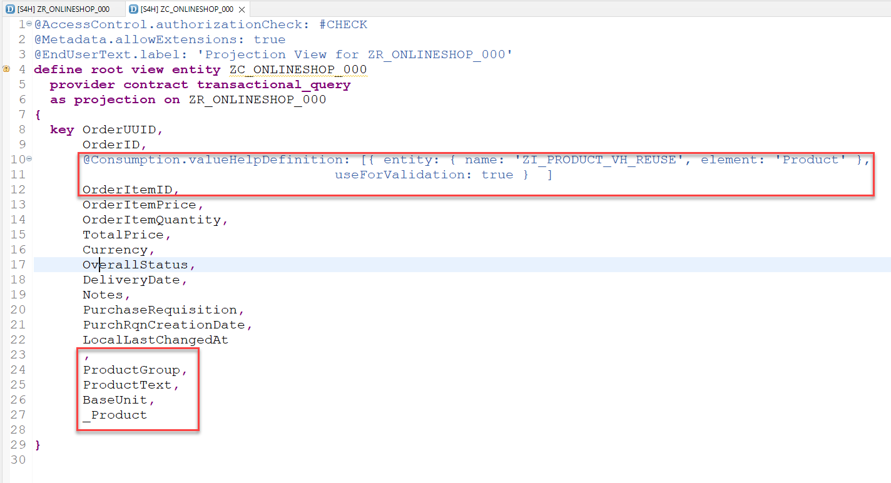

[Home ](../../README.md)  

# Exercise 3: Adapt the data model

## Introduction

In this exercise, you will adapt the data model of the newly generated RAP business object `ZR_ONLINESHOP_###`

<!--
## Exercise 3.0: Enhance the data model

In this step we will use a value help `ZI_PRODUCT_VH_REUSE` that has been provided for your in this workshop in the demo system. In addition some fields that are accessible via this association (e.g. the product description) will be included in the data model.  

When working with a system provided as part of a SAP workshop this view will be provided. If you try out this script in your own SAP S/4HANA 2022 on prem system you would have to create this view manually.  

The source code of ZI_PRODUCT_VH_REUSE can be found here:   
 [ZI_PRODUCT_VH_REUSE](sources/ZI_PRODUCT_VH_REUSE.txt) 

1. Open the cds view `ZR_ONLINESHOP_###` 

  

2. Add an association to the released CDS view for product data to it.
<pre lang="ABAP">
association [1..1] to ZI_PRODUCT_VH_REUSE as _Product on $projection.OrderItemID = _Product.Product
</pre>

3. Add the fields `_Product.ProductGroup`, `_Product.ProductText`, `_Product.BaseUnit` and the association `_Product` to the field list.

<pre lang="ABAP">
      ,
      _Product.ProductGroup,
      _Product.ProductText,
      _Product.BaseUnit,
      _Product
</pre>

  

4. Save and activate your changes

5. Open the cds view `ZC_ONLINESHOP_###` 
   
6. Add a value help for the field `OrderItemID`.
<pre lang="ABAP">
      @Consumption.valueHelpDefinition: [{ entity: { name: 'ZI_PRODUCT_VH_REUSE', element: 'Product' },
                                     useForValidation: true }  ]
</pre>

7. Add the fields `ProductGroup`, `ProductText`, `BaseUnit`, `CreatedAt` and the association `_Product` to the field list.
<pre lang="ABAP">
       ,
      CreatedAt,
      ProductGroup,
      ProductText,
      BaseUnit,
      _Product
</pre>

 

8. Save and activate your changes

-->
<!--
> **Note:**   
> When a starter project has been generated the field `CreatedAt` has already been added to the projection view.  
> You will thus get the following error message: *The name CreatedAt is not unique*   
> In this case simply delete or comment out the duplicate `CreatedAt` entry.
>    
>  
-->
 
## Exercise 3.1: Provide Metadata Extension for Fiori elements UI
 
1. Replace the complete source code of the Metadata Extension File **ZC_ONLINESHOP_###**.   

 

  Replace the placeholder `###` with your group ID and save and activate your changes.    

 
<pre lang="ABAP">
@Metadata.layer: #CORE
@UI: {
  headerInfo: {
    typeName: 'onlineshop',
    typeNamePlural: 'onlineshops'
  }
}
annotate view ZC_ONLINESHOP_XXX with
{
  @UI.facet: [ {
    id: 'idIdentification',
    type: #IDENTIFICATION_REFERENCE,
    label: 'onlineshop',
    position: 10
  } ]
  @UI.hidden: true
  orderuuid;

  @UI.lineItem: [ {
    position: 30 ,
    label: 'Order ID' ,
    importance: #MEDIUM
  } ]
  @UI.identification: [ {
    label: 'Order ID',
    position: 30
  } ]
  orderid;

  @UI.lineItem: [ {
    position: 10 ,
    label: 'Product' ,
    importance: #MEDIUM
  } ]
  @UI.identification: [ {
    position: 10,
    label: 'Product'
  } ]
  product;

  @UI.lineItem: [ {
    position: 20 ,
    label: 'Quantity' ,
    importance: #MEDIUM
  } ]
  @UI.identification: [ {
    position: 20 ,
    label: 'Quantity'
  } ]
  quantity;
  
  @UI.lineItem: [ {
    position: 40 , 
    label: 'PurchaseRequisition',
    importance: #MEDIUM
  } ]
  @UI.identification: [ {
    label: 'PurchaseRequisition',
    position: 40 
  } ]
  purchaserequisition;
  
  @UI.lineItem: [ {
    position: 50 , 
    label: 'Overall Status',
    importance: #MEDIUM
  } ]
  @UI.identification: [ {
    label: 'Overall Status',
    position: 50 
  } ]
  overallstatus;
  
  @UI.hidden: true
  locallastchangedat;
}
</pre>

  This metadata extension file includes the annotations that tell the Fiori elements UI which columns should go into the result list and which fields group a form on the object page. While most of the code was already generated automatically, we now add a couple of labels to the column headers and for the form and change the order of fields a bit to make the form nicer (order is changed via the 'importance' annotation).

2. Save  and activate  the changes.

## Exercise 3.2: Adapt the behavior definition

<!--
Since we have changed the field list of the projection view `ZC_ONLINESHOP_###` we have to regenerate the draft table.
-->

In the behavior definition we will also set several fields as read-only.

For fields that are read-only and that are not read from the value help we have to create determinations. 
  
  1. Open the behavior definition `ZR_ONLINESHOP_###`.  

    

  2. Add the following list of fields to mark them as read-only  
  <pre lang="ABAP">
   OrderID,
   PurchaseRequisition,
   OverallStatus,
  </pre>

  behind

  <pre lang="ABAP">
{
  field ( readonly )
   OrderUUID,
  </pre>

  in order to make the Order ID a read-only field.

    
 
  3. Save  and activate  the changes.

  4. In the **Project Explorer** under `Business Services`->`Service Bindings`->`ZUI_ONLINESHOP_O4_###` check the UI using the Fiori Elements preview. 

  On the list, press **Create** and you should see a form like this, where **Order ID**, **Purchase Requisition** and **Overall Status** are text not input fields:

    
 
<!--
## Exercise 3.4: Define constants for lhc_onlineshop

As a preparation for implementing determinations and validations we will add constants in the local handler class `lhc_onlineshop` of the the behavior implementation class `ZBP_R_ONLINESHOP_###` so that these variables can be used by all implementations.  

   

  
Click to expand!

  
  1. Navigate to the behavior implementation class `ZBP_R_ONLINESHOP_###` in the *Project Explorer* and then click on the tab *Local Types*.   

    
  
  2. Start the implementation by adding the following constants in the private section of your local handler class `lhc_onlineshop`.   

  <pre lang="ABAP">
  
CLASS lcl_OnlineShop DEFINITION INHERITING FROM cl_abap_behavior_handler.
  PRIVATE SECTION.

    CONSTANTS:
      BEGIN OF is_draft,
        false TYPE abp_behv_flag VALUE '00', " active (not draft)
        true  TYPE abp_behv_flag VALUE '01', " draft
      END OF is_draft.
    CONSTANTS:
      BEGIN OF c_overall_status,
        new            TYPE string VALUE 'New / Composing',
        new_code       TYPE int1   VALUE 2, "'New / Composing'
        submitted      TYPE string VALUE 'Submitted / Approved',
        submitted_code TYPE int1   VALUE 3, "'Submitted / Approved'
      END OF c_overall_status.
      
   </pre>

   3. Save and activate your changes.

 

-->

## Exercise 3.3: Define determinations

  We now will create a determination which is called when a new online store entry is created. The determination will calculate a new Order ID. While the OrderUUID is generated automatically by the system upon save, the Order ID we have to generate ourselves. The corresponding code looks up the currently highest number for orders and then adds 1 for a new ID.
 
  1. Add the following determination to your behavior definition **ZR_ONLINESHOP_###** (in the **Project Explorer** under **Core Data Services** -> **Behavior Definitions**)

  <pre lang="ABAP">
  determination CalculateOrderID on modify { create; }
  </pre>

    

  2. Save  and activate  the changes.

  3. Use the quick fix **Ctrl+1** (**Command+1** on Mac) to generate the appropriate methods in the behavior definition class.

   

  4. Then a new tab is openend with the generated handler that looks like this:

    

  5. Add the code snippet to implement the method `CalculateOrderID` for the determination `createOrderID`. Replace 
  <pre lang="ABAP">
      METHOD CalculateOrderID.
      ENDMETHOD.
  </pre>
  
  with:

   <pre lang="ABAP">
  
 METHOD CalculateOrderID.

    "read transfered instances
    READ ENTITIES OF ZR_OnlineShop_### IN LOCAL MODE
      ENTITY OnlineShop
        ALL FIELDS
        WITH CORRESPONDING #( keys )
      RESULT DATA(OnlineOrders).

    "ignore  entries with assigned order ID
    DELETE OnlineOrders WHERE OrderID IS NOT INITIAL.
    IF OnlineOrders IS NOT INITIAL.
      "get max order ID from the relevant active and draft table entries
      SELECT FROM ZOnlineShop_### FIELDS MAX( order_id ) INTO @DATA(max_order_id). "active table
      SELECT FROM ZdOnlineShop_### FIELDS MAX( orderid ) INTO @DATA(max_order_id_draft). "draft table

      IF max_order_id_draft > max_order_id.
        max_order_id = max_order_id_draft.
      ENDIF.

      DATA(OverallStatus) = |{ sy-uname } - is placing order request|.
      MODIFY ENTITIES OF ZR_OnlineShop_### IN LOCAL MODE
        ENTITY OnlineShop
          UPDATE FIELDS ( OrderID OverallStatus )
          WITH VALUE #( FOR order IN OnlineOrders INDEX INTO i (
                           %tky          = order-%tky
                           OrderID       = max_order_id + i
                           OverallStatus = overallstatus
                      ) )
        FAILED DATA(failed).

      MODIFY ENTITIES OF zr_onlineshop_### IN LOCAL MODE
        ENTITY OnlineShop EXECUTE CreatePurchaseRequisition FROM CORRESPONDING #( keys ).
    ENDIF.

  ENDMETHOD.
 
  </pre>

  6. Replace the placeholder `###` with your group ID.

  The code reads all entries including the one that was just created. It looks at all the orders whether they already have an `OrderID`, it finds the order with the highest `OrderID`, assuming this is the newest. It adds 1 to the highest `OrderID` and assigns this new number to our new onlineshop record and modifies the database using EML ([Entity Manipulation Language](https://help.sap.com/docs/btp/sap-abap-restful-application-programming-model/entity-manipulation-language-eml))
 
 7. Save  the changes. The implementation of the internal action `CreatePurchaseRequisition` will be added in the next section.

## Exercise 3.4: Add an additonal internal action to create a Purchase Requisition

1. Add the following line to your behavior implementation `ZBP_R_ONLINESHOP_###` (in the project explorer under **Source Code Library** -> **Classes**, make sure to switch to the `Global Class` tab in the ADT editor)

<pre lang="ABAP">
CLASS-DATA mapped_purchase_requisition TYPE RESPONSE FOR MAPPED i_purchaserequisitiontp.
</pre>

Add it below the `public section.` line, so it looks like this:

<pre lang="ABAP">
  class ZBP_R_ONLINESHOP_### definition
    public
    abstract
    final
    for behavior of ZR_ONLINESHOP_###.

  public section.
      CLASS-DATA mapped_purchase_requisition TYPE RESPONSE FOR MAPPED i_purchaserequisitiontp.
  protected section.
  private section.
  ENDCLASS.
</pre>

2. Save  the changes.

3. Add the following internal action to your behavior definition **ZR_ONLINESHOP_###** (in the **Project Explorer** under **Core Data Services** -> **Behavior Definitions**) just behind the line for the calculation of the new order id, that you inserted before.

<pre lang="ABAP">
  internal action CreatePurchaseRequisition result [1] $self;
</pre>

    

4. Save  the changes.

5. Click on the icon on the left hand side of the new line and invoke the generation of the new method

   

6. Replace 

<pre lang="ABAP">
  METHOD CreatePurchaseRequisition.
  ENDMETHOD.
</pre>

with the following code:

<pre lang="ABAP">
  METHOD CreatePurchaseRequisition.

    DATA purchase_requisitions      TYPE TABLE FOR CREATE I_PurchaserequisitionTP.
    DATA purchase_requisition_items TYPE TABLE FOR CREATE i_purchaserequisitionTP\_PurchaseRequisitionItem.
    DATA purchase_reqn_acct_assgmts TYPE TABLE FOR CREATE I_PurchaseReqnItemTP\_PurchaseReqnAcctAssgmt.
    DATA purchase_reqn_item_texts   TYPE TABLE FOR CREATE I_PurchaseReqnItemTP\_PurchaseReqnItemText.
    DATA update_lines               TYPE TABLE FOR UPDATE zr_onlineshop_###\\OnlineShop.

    "read transfered order instances
    READ ENTITIES OF zr_onlineshop_### IN LOCAL MODE
      ENTITY OnlineShop ALL FIELDS WITH CORRESPONDING #( keys )
      RESULT DATA(OnlineOrders).

    LOOP AT OnlineOrders INTO DATA(OnlineOrder).
      DATA(n) = sy-tabix.

      "purchase requisition
      APPEND VALUE #( %cid                    = OnlineOrder-OrderUUID
                      purchaserequisitiontype = 'NB' ) TO purchase_requisitions.

      "purchase requisition item
      APPEND VALUE #( %cid_ref = OnlineOrder-OrderUUID
                      %target  = VALUE #( (
                                   %cid                        = |My%ItemCID_{ n }|
                                   plant                       = '1010'  "Plant 01 (DE)
                                   accountassignmentcategory   = 'U'  "unknown
*                                  PurchaseRequisitionItemText =      "retrieved automatically from maintained MaterialInfo
                                   requestedquantity           = '1'
                                   purchaserequisitionprice    = '100'
                                   purreqnitemcurrency         = 'EUR'
                                   Material                    = 'D001'
                                   materialgroup               = 'A001'
                                   purchasinggroup             = '001'
                                   purchasingorganization      = '1010'
                                   DeliveryDate                = CONV #( cl_abap_context_info=>get_system_date(  ) + 14 )
                                 ) ) ) TO purchase_requisition_items.

      "purchase requisition account assignment
      APPEND VALUE #( %cid_ref = |My%ItemCID_{ n }|
                      %target  = VALUE #( (
                                   %cid       = |My%AccntCID_{ n }|
                                   CostCenter = 'JMW-COST'
                                   GLAccount  = '0000400000'
                                 ) ) ) TO purchase_reqn_acct_assgmts.

      "purchase requisition item text
      APPEND VALUE #( %cid_ref = |My%ItemCID_{ n }|
                      %target  = VALUE #( (
                                   %cid           = |My%TextCID_{ n }|
                                   textobjecttype = 'B01'
                                   language       = 'E'
                                   plainlongtext  = OnlineOrder-Product
                                 ) ) ) TO purchase_reqn_item_texts.
    ENDLOOP.

    "EML deep create statement
    IF keys IS NOT INITIAL.
      MODIFY ENTITIES OF i_purchaserequisitiontp
        ENTITY purchaserequisition
          CREATE FIELDS ( purchaserequisitiontype )
            WITH purchase_requisitions
          CREATE BY \_purchaserequisitionitem
            FIELDS ( plant
                     accountassignmentcategory
                     requestedquantity
                     purchaserequisitionprice
                     purreqnitemcurrency
                     Material
                     materialgroup
                     purchasinggroup
                     purchasingorganization
                     DeliveryDate
                   )
            WITH purchase_requisition_items
        ENTITY purchaserequisitionitem
          CREATE BY \_purchasereqnacctassgmt
            FIELDS ( CostCenter
                     GLAccount )
            WITH purchase_reqn_acct_assgmts
          CREATE BY \_purchasereqnitemtext
            FIELDS ( plainlongtext )
            WITH purchase_reqn_item_texts
        REPORTED DATA(reported_create_pr)
        MAPPED DATA(mapped_create_pr)
        FAILED DATA(failed_create_pr).
    ENDIF.

    "buffer the generated key information
    "the correct value for PurchaseRequisition has to be calculated in the save sequence using convert key
    zbp_r_onlineshop_###=>mapped_purchase_requisition-purchaserequisition = mapped_create_pr-purchaserequisition.

    LOOP AT keys INTO DATA(key_update).
      APPEND VALUE #( %tky          = key_update-%tky
                      OverallStatus = 'submitted' ) TO update_lines.
    ENDLOOP.

    MODIFY ENTITIES OF zr_onlineshop_### IN LOCAL MODE
         ENTITY OnlineShop
           UPDATE
           FIELDS ( OverallStatus )
           WITH update_lines
         REPORTED reported
         FAILED failed
         MAPPED mapped.
    IF failed IS INITIAL.
      "Read the changed data for action result
      READ ENTITIES OF zr_onlineshop_### IN LOCAL MODE
        ENTITY OnlineShop
          ALL FIELDS
          WITH CORRESPONDING #( keys )
        RESULT DATA(result_read).

      "return result entities
      result = VALUE #( FOR order_changed IN result_read ( %tky   = order_changed-%tky
                                                           %param = order_changed ) ).
    ENDIF.

  ENDMETHOD.
</pre>

7. Replace the placeholder `###` with your group ID.

8. Save  and activate  the changes.

## Exercise 3.5: Add unmanaged save

We have to add the use of an unmanaged save to the behavior of our RAP business object since the Purchase Requisition API that we plan to call uses late numbering.

1. Navigate to the behavior definition ZR_ONLINESHOP_### either in the Project Explorer (**Core Data Services** -> **Behavior Definitions**) or by opening it as a development object using the short cut Ctrl+Shift+A.

2. Open the behavior definition and add the statement 

<pre lang="ABAP">
with unmanaged save 
</pre>

right after the 

<pre lang="ABAP">
authorization master ( global ) 
</pre>

statement.

In addition comment out the statement that specifies the persistent table of our RAP BO `//persistent table zaonlineshop_###` since it is not possible to use both statements in the same behavior definition. 

It should then look like this:

<pre lang="ABAP">
managed implementation in class ZBP_R_ONLINESHOP_### unique;
strict ( 2 );
with draft;

define behavior for ZR_ONLINESHOP_### alias onlineshop
//persistent table zonlineshop_###
draft table ZDONLINESHOP_###
etag master LocalLastChangedAt
lock master total etag LastChangedAt
authorization master( global )
with unmanaged save
</pre>

3. Save  and activate all  the changes.

4. After having activated your changes select the key word `unmanaged` and select Ctrl + 1 (Command +1 on Mac) to start the code assistant.

 

This will add a local saver class `lsc_zr_onlineshop_###` to the local classes of your behavior implementation class (in the **Project Explorer** under **Source Code Library** -> **Classes**, in the `Local Types` tab in the ADT Editor). The method `save_modified` is added to the `DEFINITION` and the `IMPLEMENTATION` section of this local class.

<pre lang="ABAP">
CLASS lsc_zr_onlineshop_### DEFINITION INHERITING FROM cl_abap_behavior_saver.

  PROTECTED SECTION.

  METHODS save_modified REDEFINITION.
  
ENDCLASS.
</pre>

5. Save  the changes.

6. To implement the `save_modified()` method, replace:

<pre lang="ABAP">
  METHOD save_modified.
  ENDMETHOD.
</pre>

with:

<pre lang="ABAP">
   METHOD save_modified.

    DATA onlineshop_db TYPE STANDARD TABLE OF zonlineshop_###.

    IF create-onlineshop IS NOT INITIAL.
      onlineshop_db = CORRESPONDING #( create-onlineshop MAPPING FROM ENTITY ).

      "determine the ID of the created purchase requisition and store it as a reference in the created order
      LOOP AT onlineshop_db ASSIGNING FIELD-SYMBOL(&#60;order&#62;).
        READ TABLE zbp_r_onlineshop_###=>mapped_purchase_requisition-purchaserequisition ASSIGNING FIELD-SYMBOL(&#60;pr_mapped&#62;)
                   WITH KEY cid COMPONENTS %cid = &#60;order&#62;-order_uuid.
        IF sy-subrc = 0.
          CONVERT KEY OF i_purchaserequisitiontp FROM &#60;pr_mapped&#62;-%pid TO DATA(pr_key).
          &#60;order&#62;-purchase_requisition = pr_key-purchaserequisition.
        ENDIF.
      ENDLOOP.

      INSERT zonlineshop_### FROM TABLE @onlineshop_db.
    ENDIF.

    LOOP AT delete-onlineshop INTO DATA(onlineshop_delete) WHERE OrderUUID IS NOT INITIAL.
      DELETE FROM zonlineshop_### WHERE order_uuid = @onlineshop_delete-OrderUUID.
      DELETE FROM zdonlineshop_### WHERE orderuuid = @onlineshop_delete-OrderUUID.
    ENDLOOP.

  ENDMETHOD.
</pre>

7. Replace the placeholder `###` with your group ID.

8. Save  and activate  the changes.

## Exercise 3.6: Check your preview application

 1. Open the service binding `ZUI_ONLINESHOP_O4_###` (**Business Services** -> **Service Bindings**) to test your implementation by using the ADT Fiori preview. Alternatively, if you keep the browser window open with the Fiori preview, you can just refresh the browser and it will automatically reflect the new code.

 2. On the list, press `Create` and then on the object page enter a new onlineshop entry using for example a product `AS01` and a quantity `1` and then press the `Create` button in lower right corner.
  
  
  
  
  The order id gets calculated and a new purchase requisition gets created in S/4HANA and you should see it in the result:

  

 ## Summary  
 
 You have implemented an adjustment to the Fiori elements UI and a determination to calculate a new order ID and to create a purchase requisiton in S/4HANA.   

 You can continue with the next exercise - **[Exercise 4: Create a Web API for the Onlineshop](../ex4/README.md)**.
 

