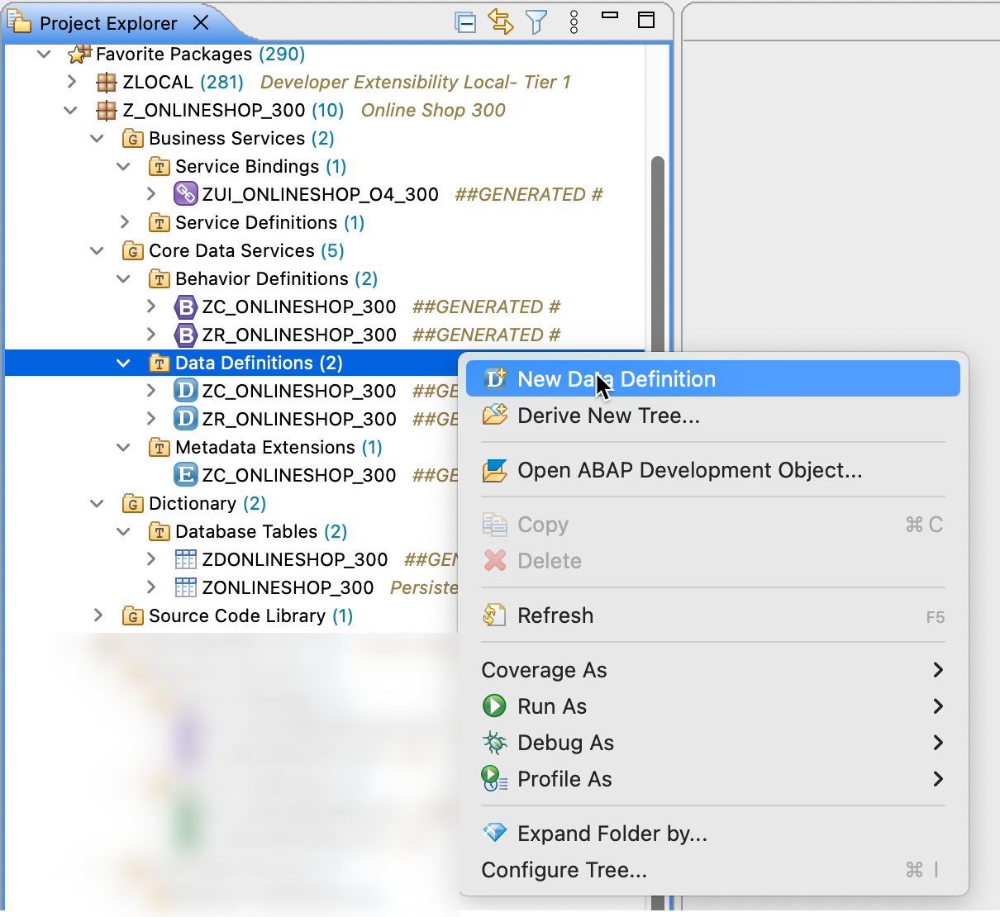
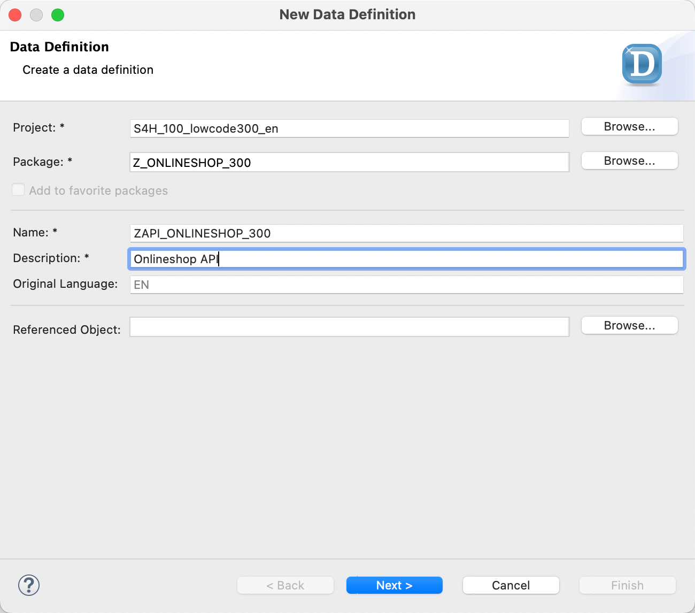
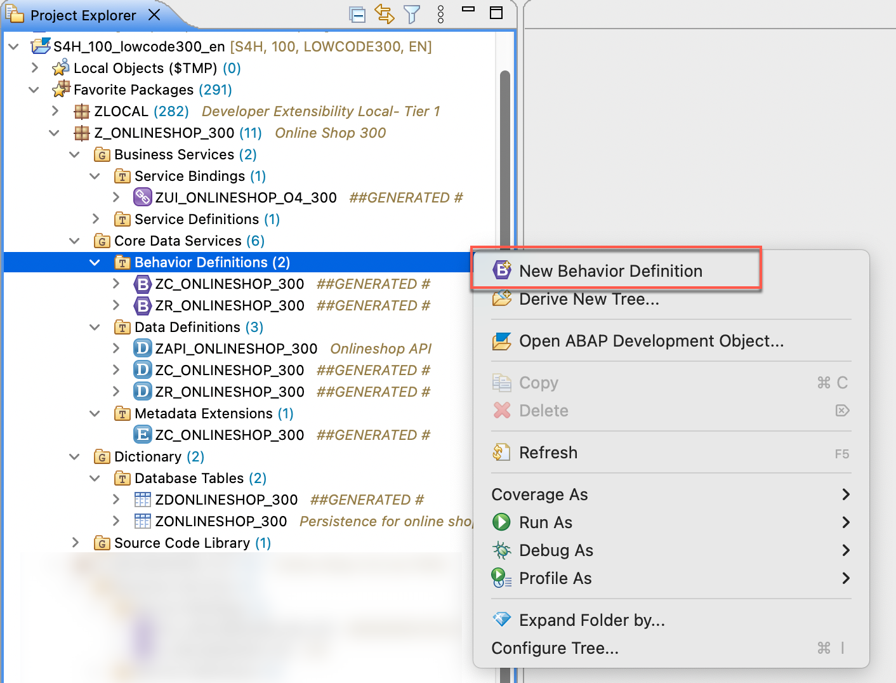
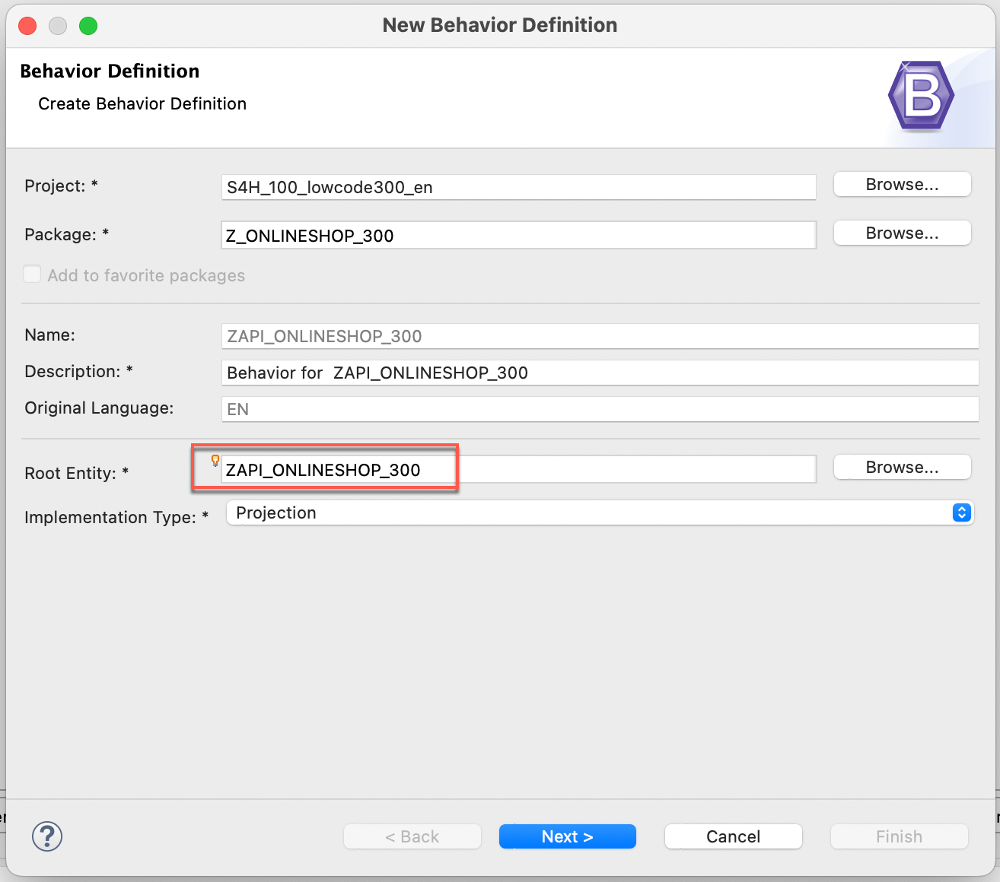
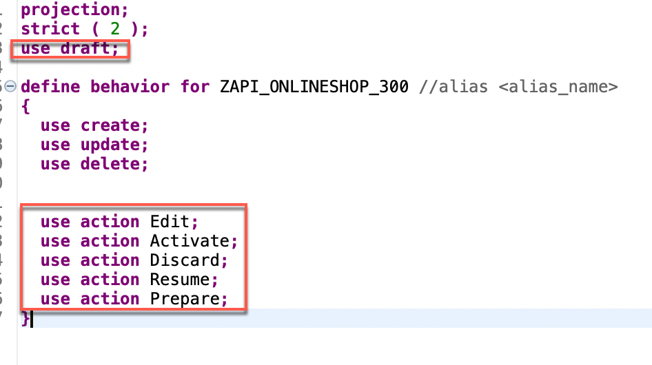
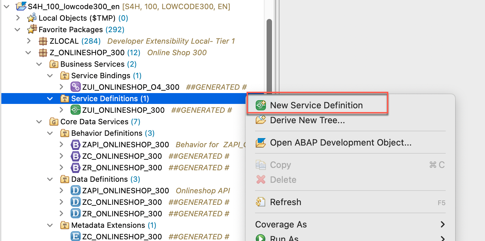
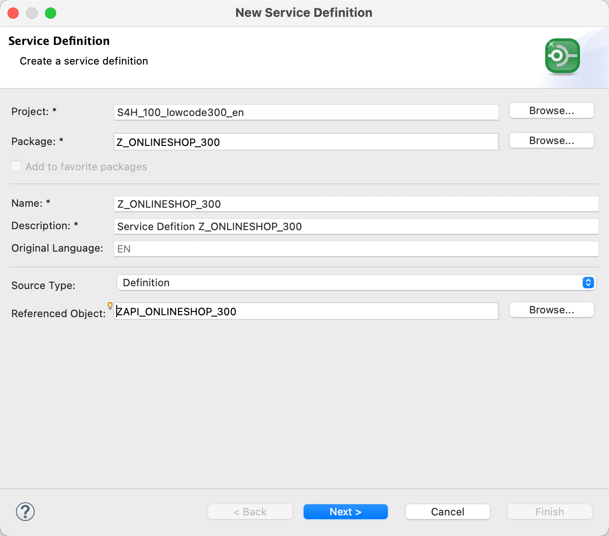
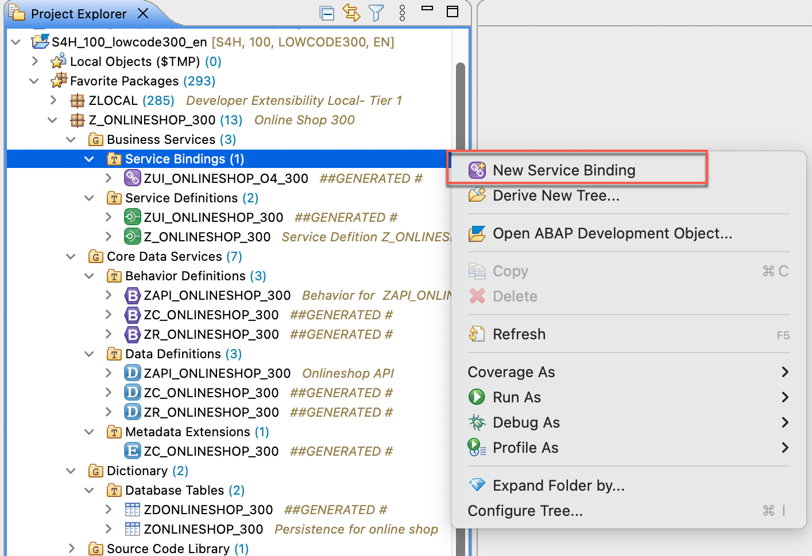
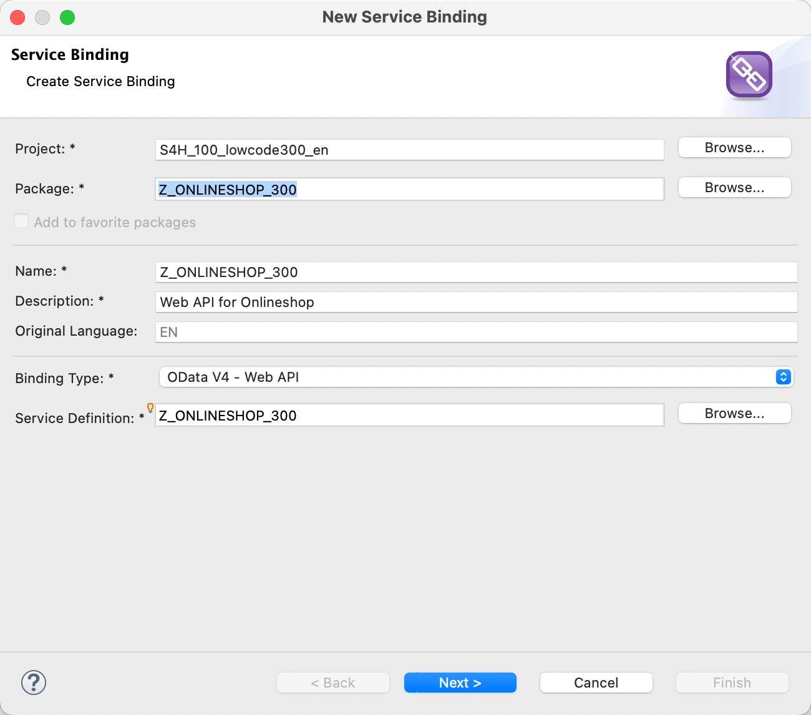
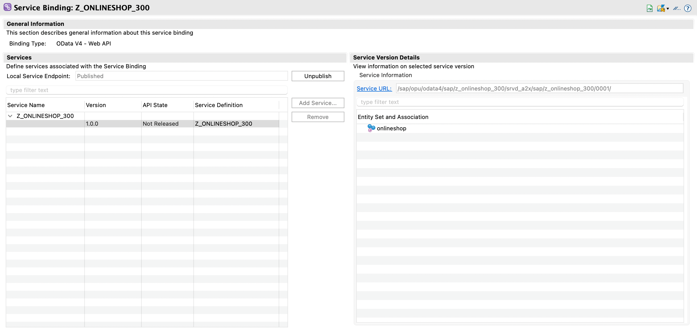

# Exercise 4: Create a Web API for the Onlineshop

In this exercise we create an additional service. In the exercise before we created an Onlineshop service that we can use for a Fiori elements application which supports drafts (the ability to save UI entries in an unfinished or wrong state for the current user, in order to allow the user to correct the entry later. The entry will only become visible when the entry was finally corrected and saved.). These kind of services are not suitable to be called from other places than UIs, for example processes. As we later on want to create a process, we will now add a second service for web API usage. 

For this we need to add a couple of artefacts on top of the already existing ones.

## Exercise 4.1: Create a new Data Definition

1. In your project open the context menu on **Core Data Services** -> **Data Definitions** and select **New Data Definition**.

 

2. Maintain the required information (`###` is your group ID) and click **Next >**.
      - Name: _**`ZAPI_ONLINESHOP_###`**_  
      - Description: _**`Onlineshop API`**_  

 

3.  Select your transport request and click **Finish** to create the data definition.

4. Overwrite the contents of the generated data definition like this

<pre lang="ABAP">
@AccessControl.authorizationCheck: #CHECK
@Metadata.allowExtensions: true
@EndUserText.label: 'Projection View for ZR_ONLINESHOP_###'
define root view entity ZAPI_ONLINESHOP_###
  provider contract transactional_query
  as projection on ZR_ONLINESHOP_###
{
  key OrderUUID,
  OrderID,
  Product,
  Quantity,
  LocalLastChangedAt
}
</pre>

5. Replace the placeholder `###` with your group ID. 

6. Save  and activate  the changes.

## Exercise 4.2: Create a new Behavior Definition

1. In your project open the context menu on **Core Data Services** -> **Behavior Definitions** and select **New Behavior Definition**.

 

2. Maintain the required information (`###` is your group ID):
      - Description: _**`Behavior for ZAPI_ONLINESHOP_###`**_
      - Root Entity: _**`ZAPI_ONLINESHOP_###`**_
      - Implementation Type: _**`Projection`**_
       
      Click **Next >**.

 

3. Select your transport request and click **Finish**.

4. In the generated code get rid of the `use draft` line and all the lines that start with `use action`

 

5. Add `alias onlineshop` as an alias, the code should look like this:

<pre lang="ABAP">
projection;
strict ( 2 );

define behavior for ZAPI_ONLINESHOP_### alias onlineshop
{
  use create;
  use update;
  use delete;
}
</pre> 

7. Save  and activate  the changes.

## Exercise 4.3: Create a new Service Definition

1. In your project open the context menu on **Business Services** -> **Service Definition** and select **New Service Definition**.

 

2. Maintain the required information (`###` is your group ID):
      - Name: _**`Z_ONLINESHOP_###`**_
      - Description: _**`Service Definition Z_ONLINESHOP_###`**_
      - Source Type: _**`Definition`**_
      - Referenced Object: _**`ZAPI_ONLINESHOP_###`**_
       
      Click **Next >**.

 

3. Select your transport request and click **Finish**.

5. Add the alias `as onlineshop`. The code should look like this:

<pre lang="ABAP">
@EndUserText.label: 'Service Defition Z_ONLINESHOP_###'
define service Z_ONLINESHOP_### {
  expose ZAPI_ONLINESHOP_### as onlineshop;
}
</pre>

6. Save  and activate  the changes.

## Exercise 4.4: Create a new Service Binding

1. In your project open the context menu on **Business Services** -> **Service Bindings** and select **New Service Bindings**.

 

2. Maintain the required information (`###` is your group ID):
      - Name: _**`Z_ONLINESHOP_###`**_
      - Description: _**`Web API for Onlineshop`**_
      - Binding Type: _**`OData V4 - Web API`**_
      - Service Definition: _**`Z_ONLINESHOP_###`**_
       
      Click **Next >**.

 

3. Select your transport request and click **Finish**.

4. Save  and activate  the changes.

5. On the resulting UI press the `Publish` button, the result looks like this:

 

## Exercise 4.5: Test the API in the browser

1. Press on the link `Service URL` in the picture above. This will open the service in the browser.

2. In the browser, remove `?sap-client=100` from the URL and add `onlineshop` at the end of the URL, so it looks like this

https://YY.YYYY.YYY.YY:44301/sap/opu/odata4/sap/z_onlineshop_###/srvd_a2x/sap/z_onlineshop_###/0001/onlineshop

3. Press enter to load the page. The result should display the order you created in the previous exercise:

<pre lang="JSON">
{
    "@odata.context": "$metadata#onlineshop",
    "@odata.metadataEtag": "W/\"20230512011226\"",
    "value": [
        {
            "OrderUUID": "41d67ed4-f6d7-1edd-bc8c-0d6a2c2a133f",
            "OrderID": "        1",
            "Product": "AS01",
            "Quantity": 1,
            "LocalLastChangedAt": "2023-05-12T01:00:52.710668Z",
            "SAP__Messages": []
        }
    ]
}
</pre>

## Summary   

You have created a Web API next to the one that is suitable for a UI and you can now use this API in a SAP Build Process.

You can continue with the next exercise - **[Build Exercise 1: Create Actions in SAP Build to access the Onlineshop API](../../../build/exercises/ex1/README.md)**
